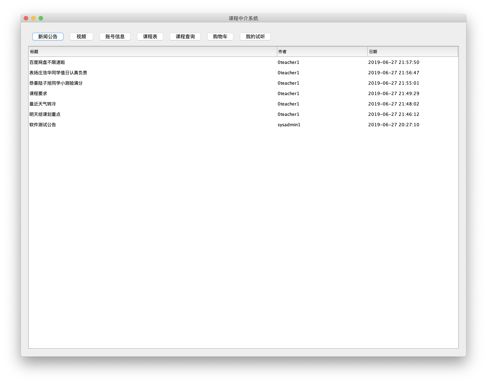

# 2019 年软件工程课程设计测试报告

| 项目名称 | 课程中介系统                 |
| -------- | ---------------------------- |
| 日期     | 2019-06-21～2019-06-27       |
| 测试人员 | 刘威、陆子旭、李晓宇、李语尧 |

## 简介

本文为软件工程课程设计之课程中介系统的测试报告，总结了课程中介系统APP测试阶段的情况并对测试结果进行了分析，并据此对未来可改进方向提出了建议。

## 测试概要

整个课程中介系统项目的测试经历了xx-1.0与xx-1.1两个阶段，共经历了1轮集成测试、6轮冒烟测试和7轮系统测试和1轮上线跟踪测试。整个测试过程中累计执行用例8100条，发现缺陷1026个。截至xx-1.1第四系统测试结束，所发现的高权重问题已得到修复和验证。

### 测试时间

整个xx项目的测试时间从xx年2月18日开始，到xx年3月27日上线止，期间各阶段工作情况如下：

| 工作阶段 | 开始时间         | 结束时间         | 工作量 |
| -------- | ---------------- | ---------------- | ------ |
| 检查基本流是否完全实现| 2019-06-21 19:00 | 2019-06-21 21:00 | 4      |
| 检查数据库约束条件和数据格式| 2019-06-22 19:00 | 2019-06-23 20:00 | 5        |
| 检测界面的功能完整性，对友好度进行微调 | 2019-06-24 13:00 | 2019-06-24 19:00 | 3      |
| 检查BUG，优化代码结构 | 2019-06-25 09:00 | 2019-06-27 21:00 | 8      |
### 测试范围

本次测试覆盖的范围包括：数据和数据库完整性测试、接口测试、功能性测试和用户界面测试。下面予以说明：

#### 数据和数据库完整性测试

| 关注项                        | 权重 |
| ----------------------------- | ---- |
| Account类型账户结构完整性     | A    |
| Account类型账户数据格式化处理 | B    |
| News、Video、Comment数据传输  | C    |

#### 接口测试

| 关注项                                 | 权重 |
| -------------------------------------- | ---- |
| Java Account对接接口                   | A    |
| 各项News、Video、Comment的增删查改接口 | A    |
| 界面交互接口                           | C    |

#### 功能性测试

| 模块               | 权重 |
| ------------------ | ---- |
| 各类用户注册、登录  |   A   |
| 各类用户个人信息查看与修改                    |     A |
| 各类用户查看新闻公告、视频  |A|
| 学生家长查看课表并申请试听                   |  A    |
| 教育机构或个人教师设置课表                   |   A   |
| 教育机构或个人教师发表公告                   |   A   |
| 管理员审核权限                   | A     |
| 管理员修改编辑评论、公告                   |   A   |

#### 用户界面测试

>
>
>**家长-个人信息**

>
>
>**家长-我的试听**

>
>
>**家长-新闻公告**

>
>
>**家长-视频**

>
>
>**家长-课程查询**

>
>
>**家长-课程表**

>
>
>**家长-课程详细情况**

>
>
>**家长-购物车**

>
>
>**家长注册**

>
>
>**教师-新闻公告**

>
>
>**教师-试听申请**

>
>
>**教师-账号信息**

>
>
>**教师注册**

>
>
>**机构-发布课程**

>
>
>**机构-新闻公告**

>
>
>**机构-视频**

>
>
>**机构-课程表**

>
>
>**机构-账号信息**

>
>
>**机构注册**

>
>
>**登录**

>
>
>**管理员-修改新闻公告**

>
>
>**管理员-修改用户评论**

>
>
>**管理员-修改视频**

>
>
>**管理员-修改评论**

>
>
>**管理员-增加新闻公告**

>
>
>**管理员-教师申请列表**

>
>
>**管理员-新闻公告**

>
>
>**管理员-机构申请列表**

>
>
>**管理员-添加视频**

>
>
>**管理员-视频**

>
>
>**管理员-课程表**

>
>
>**管理员-账号信息**

## 结果分析

## 总结和评价

**测试评估**

本次测试经历5天时间，主要进行了功能性测试、安全性测试、兼容性测试和性能测试。经测试，所开发系统在功能性、安全性、兼容性等方面能够达到预期的要求，能够保障系统功能实现，各方面均能够满足客户需求。

**测试总结和改进建议**

此次测试严格按照项目计划和测试计划执行，完成了测试计划规定的测试对象的测试。针对测试计划规定的测试策略，在测试执行中都有体现，在测试执行过程中，依据测试计划对系统进行了完整的测试。

**测试用例执行情况**

**测试结果展示**