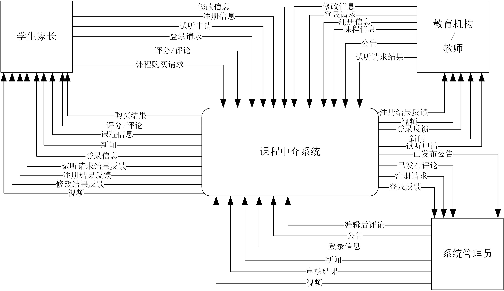
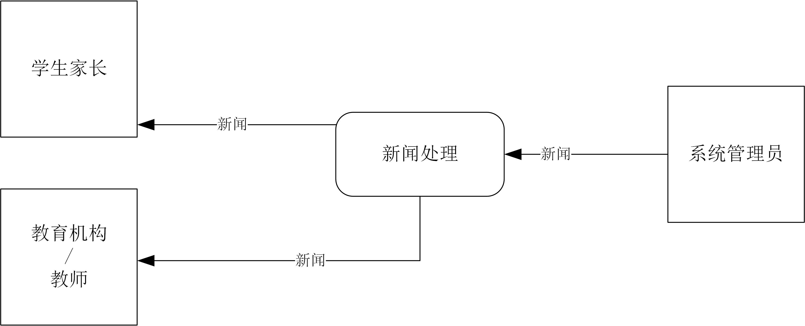
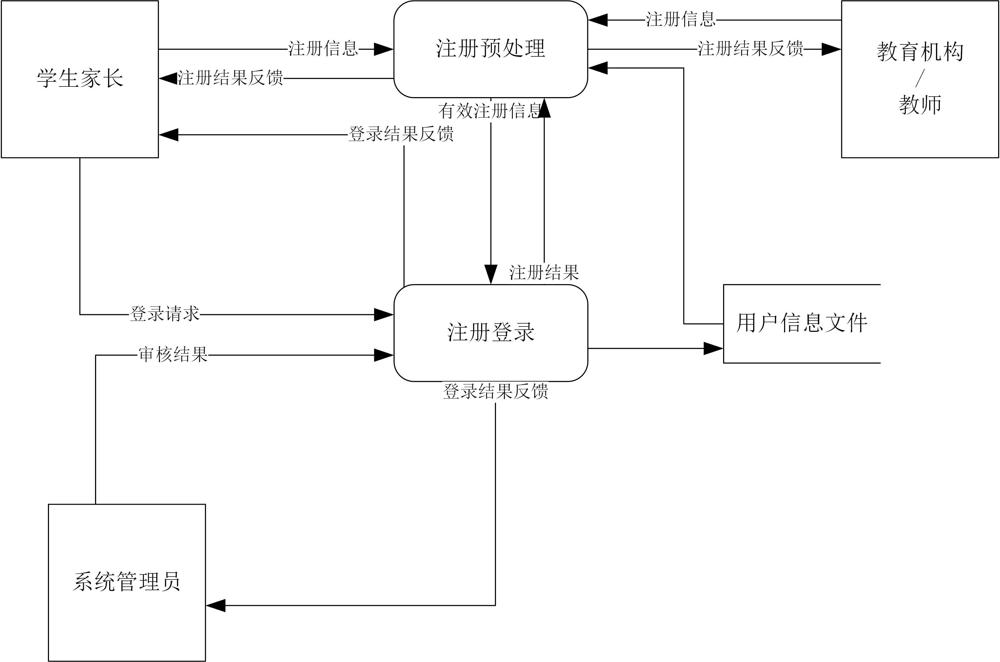
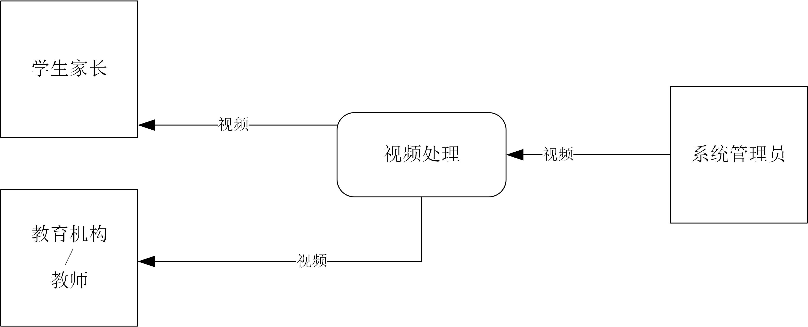
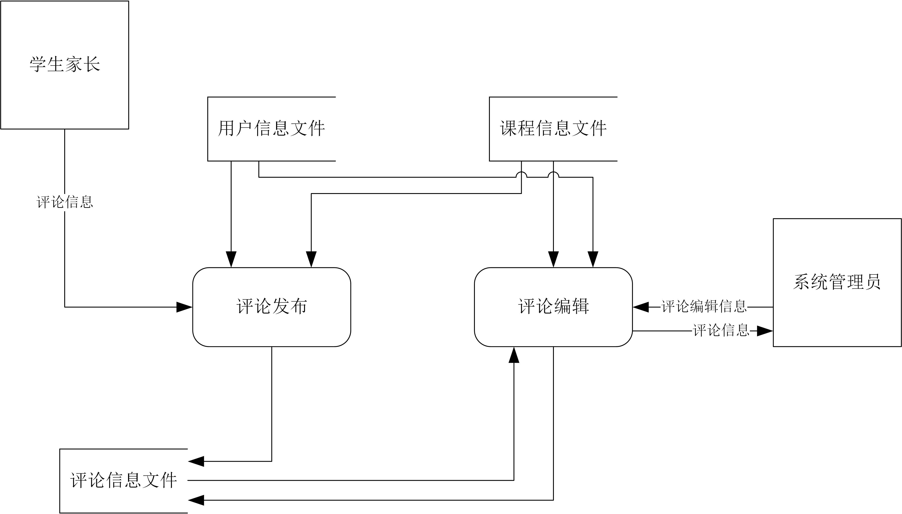
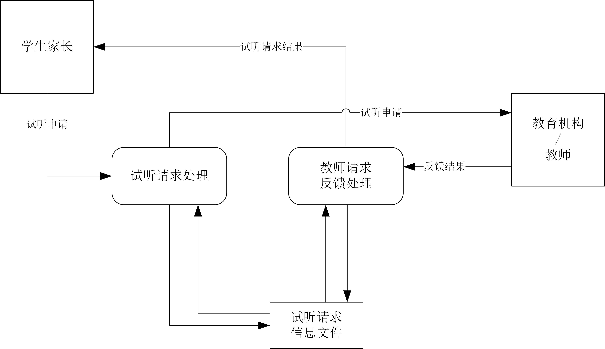
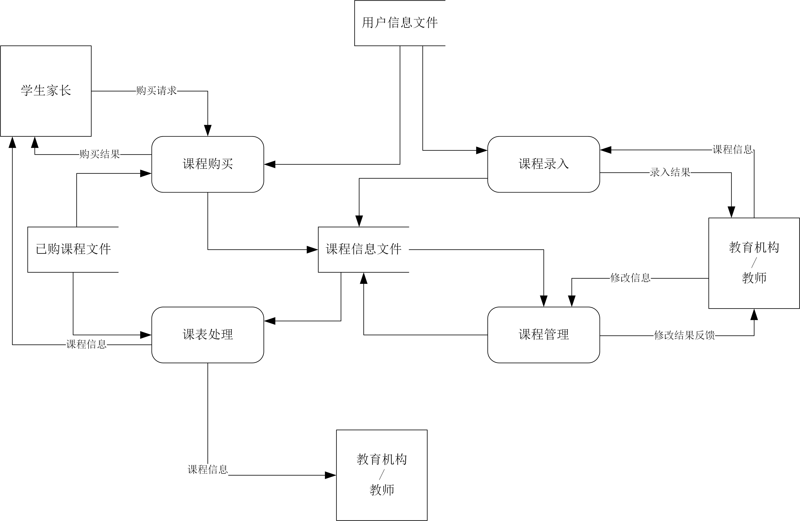
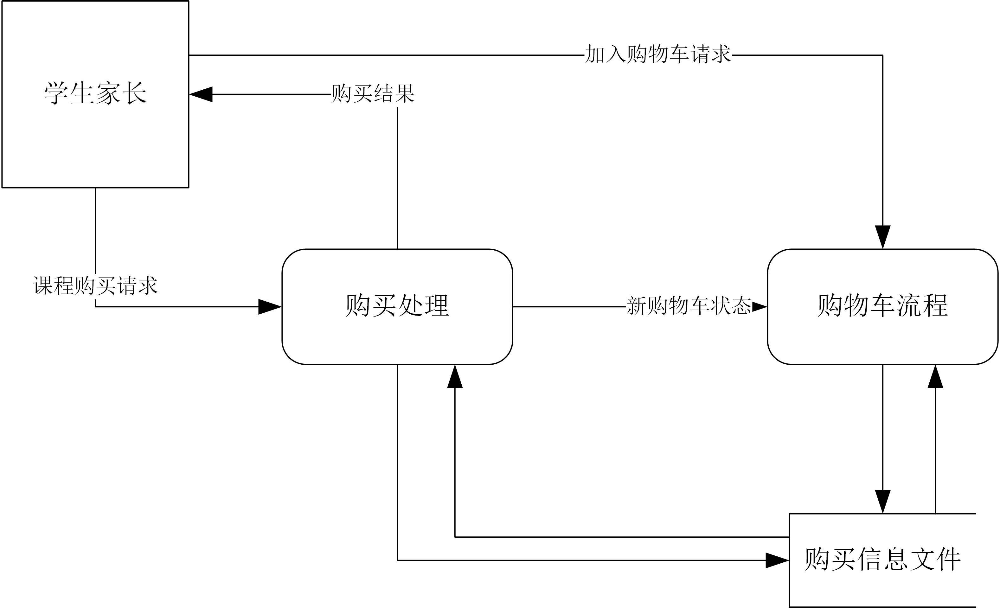

# 需求分析
## 问题背景及描述

现代社会的发展，带来网络的普及，软件应用在各个方面，在选课方面，
由于线下选课具有耗时，难以统计，不方便等诸多问题，因此，需要
设计一个网上选课系统，对于选课进行操作统计。为此，设计一个线上选课系统，
来方便学生家长，教育机构（个人教师）进行一系列操作是很有必要的。

## 功能分析

该系统可以实现对于公告、新闻和视频的发布，
也可以实现各用户的注册和登录，并且学生家长还可以进行选课，
进行课程试听，付费等功能；对于教育机构而言，可以发表课程信息，
发表公告等一系列功能，按照系统要求，我们将功能进行划分。

## 功能描述

### 注册：

对于学生家长、教育机构和个人教师而言，可以在系统中进行注册，用户根据自己选择注册类型，输入一系列相关信息，系统进行保存。注册完毕后，学长家长可直接登录，教育机构和个人教师需要审批。

### 修改个人信息：

在用户登录的情况下，登陆后进行修改，读取已有的信息，对可修改的信息，用户可以进行修改，对于不可修改的信息不可修改

### 登录：

用户通过已经注册的用户名和密码进行登录，登录完成后可以看到与用户类型相对应的界面。

### 查询课程信息：

用户登录到系统后，可以通过关键字对课程信息进行查询，查询结果可以跳转到介绍页面。

### 申请试听：

学生家长登录系统后，可以进行申请试听，并保存信息到数据库，也可以取消试听。

### 付费：

学生家长登录系统后，可以将课程添加到购物车，并进行购买，购买后系统会保存记录。

###发表评论：

学生家长登陆系统后，可以对以试听的课程发表评论，评论对象可以不同，评论方式有打分、贴图片、写文字、星级评价等。

### 查看试听申请：

教育机构或个人教师登陆系统后，可以对试听申请进行查看，显示申请信息，并可以接受或拒绝申请。

### 设置课表：

教育机构或个人教师登录系统后，可以对课表内容进行修改，包括添加、删除、修改等一系列操作，对于信息的修改，包括对于时间、地点、任课教师和课程内容等信息。

### 设置费用：

教育机构或个人教师登录系统后可以对课程费用进行设置，系统会保存记录修改后的信息。

### 发表公告：

教育机构或个人教师登陆系统后，可以发表最新的公告，可以添加、删除、修改公告信息等，公告信息为文字或图片。

### 权限审核：

系统管理员对注册申请进行审核，批准符合条件的，否定不符合条件的，系统保存操作的结果，及时反馈。

### 发布新闻：

系统管理员更新用户新闻页面显示的新闻，实现对新闻的增加、删除、插入等。

### 发布视频：

系统管理员更新用户视频页面显示的视频，添加成功后提示。

### 编辑评论：

系统管理员对用户进行的评论进行修改，修改成功后提示。 

### 编辑公告：

系统管理员对教育机构发表的公告进行修改，修改成功后提示。

### 观看视频：

任意权限用户均可观看已发布的视频，并进行相关操作。

### 阅读新闻：

任意权限用户均可观看已发布的新闻，查看详细信息。

## 数据描述

1. 学生家长用户信息
2. 教育机构用户信息
3. 个人教师用户信息修改
4. 课程信息
5. 试听申请信息
6. 付费信息
7.	各种评论信息
8.	公告信息
9.  新闻信息
10.	视频信息

## 数据流图

>
>
>**0层数据流图**

>
>
>**1层-新闻**

>
>
>**1层-注册登录**

>
>
>**1层-视频**

>
>
>**1层-评论**

>
>
>**1层-试听**

>
>
>**1层-课程处理**

>
>
>**1层-购买**
